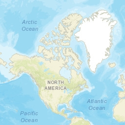
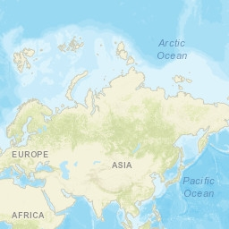
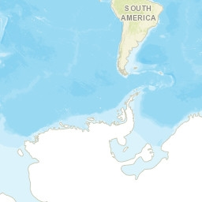
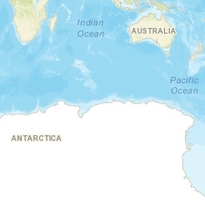

# raster-tiles-compactcache

## Documentation and sample code for Esri Compact Cache V2 format

The Compact Cache V2 is the current file format used by ArcGIS to store raster tiles.  The Compact Cache V2 stores multiple tiles in a single file called a bundle.  The bundle file structure is very simple and optimized for quick access, the result being improved performance over other alternative formats.

| | Col 0 | Col 1 |
|---|---|---|
| Row 0 |  |  |
| Row 1 |  |  |

## Content
This repository contains [documentation](CompactCacheV2.md), a [sample cache](sample_cache) and a Python 2.x [code example](sample_code) of how to build Compact Cache V2 bundles from individual image tiles.

## Licensing

Copyright 2016 Esri

Licensed under the Apache License, Version 2.0 (the "License");
you may not use this file except in compliance with the License.
You may obtain a copy of the License at

http://www.apache.org/licenses/LICENSE-2.0

Unless required by applicable law or agreed to in writing, software distributed under the License is distributed on an "AS IS" BASIS, WITHOUT WARRANTIES OR CONDITIONS OF ANY KIND, either express or implied.
See the License for the specific language governing permissions and limitations under the License.

